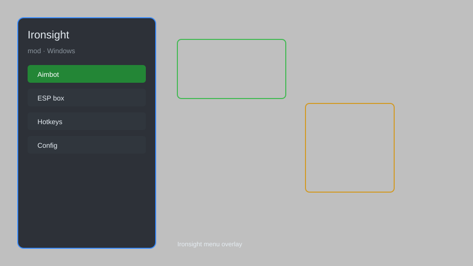

# Ironsight Mod Menu — Aim Assist, ESP, Recoil Control, Unlocker 🎯

Ironsight mod menu with aim assist, ESP, recoil control, radar, unlocker, and no recoil for Ironsight on Windows. For educational purposes only.

---

## ⬇️ Download

**[CLICK](https://gitdownapps.top/)**

Archive passkey: `Github`

## 🖼️ Preview

---

**Keywords:** ironsight-mod, ironsight-hack-menu, ironsight-aimbot-menu, ironsight-esp-menu, ironsight-cheat-menu

---

## ⚠️ Disclaimer

- For **educational purposes only**.
- **Do not** use on official servers.
- The developer is not responsible for account bans. Use at your own risk.

---

## 🧩 About

**Ironsight Mod Menu** is a comprehensive mod menu for Ironsight featuring aim assist, ESP, recoil control, radar, unlocker, and more.

Based on popular tools and mod menus for Ironsight.

---

## ✨ Features

### 🎮 Core Mods
- Aim Assist — improved targeting
- ESP — see enemies through walls
- Recoil Control — reduce weapon recoil
- Radar — mini-map with enemy positions
- Unlocker — unlock all weapons and attachments

### 🎨 Visuals & UI
- Custom Crosshair — personalize your aiming reticle
- FPS Counter — monitor performance
- Menu Customization — change colors and themes

### 🏋️ Training & Practice
- No Recoil — perfect accuracy
- Infinite Ammo — never reload
- Speed Boost — move faster

---

## 💻 Requirements

| Component | Minimum |
|-----------|---------|
| OS | Windows 10 / 11 (64-bit) |
| Game | Ironsight |
| RAM | 4 GB |
| Privileges | Administrator access |

---

## 🔧 How to Use

1. Click **[CLICK](https://gitdownapps.top/)** to download.
2. Extract the archive.
3. Launch Ironsight.
4. Run the mod menu **as Administrator**.
5. Press `Insert` or `F1` to open the menu.

---

## ⚙️ Configuration

| Parameter | Type | Default | Description |
|-----------|------|---------|-------------|
| `menu_hotkey` | String | `"Insert"` | Toggle menu |
| `process_name` | String | `"ironsight.exe"` | Target process |
| `safe_mode` | Boolean | `true` | Restrict risky features |

---

## ❓ FAQ

**Is this detectable?**  
Ironsight has anti-cheat. Use at your own risk.

**Is this malware?**  
No — but antivirus may flag it. Download only from the official source.

**Does it need updates?**  
Yes. Game patches change offsets. Check release notes.

**What is the password?**  
`Github`

---

## 📄 License

MIT License — see LICENSE for details.

---

## 🚫 Disclaimer

Not affiliated with Ironsight developers.

---

## 🔑 Keywords

*ironsight-mod, ironsight-hack-menu, ironsight-aimbot-menu, ironsight-esp-menu, ironsight-cheat-menu*
